# What the Lake Keeps

A full-screen Android narrative investigation game, built natively in Kotlin with Jetpack Compose.
This prototype has an intro sequence, a case board, and two in-game phones with working Messages,
Phone, Mail, Gallery and Settings apps.

| Studio ident | Advisory | Title | Case board | Theo's phone | Mira's phone |
|---|---|---|---|---|---|
|  | 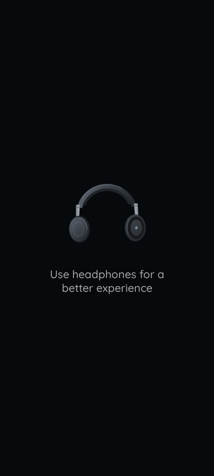 |  | 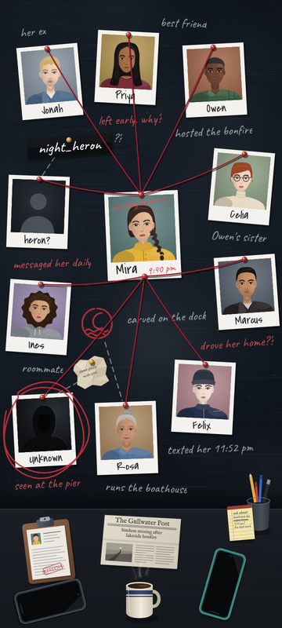 | 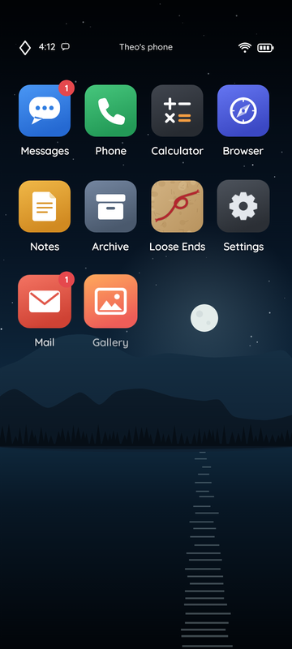 | 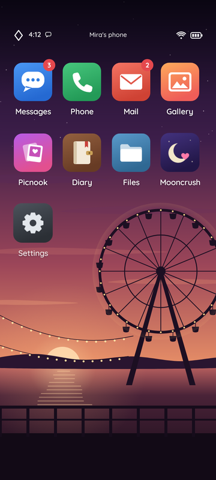 |

| New message | Live conversation | Conversation over | Inbox | Contact card | Notification shade |
|---|---|---|---|---|---|
| 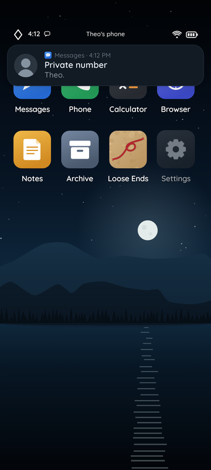 | 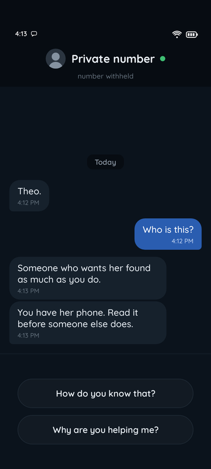 | 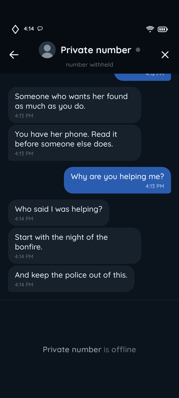 | 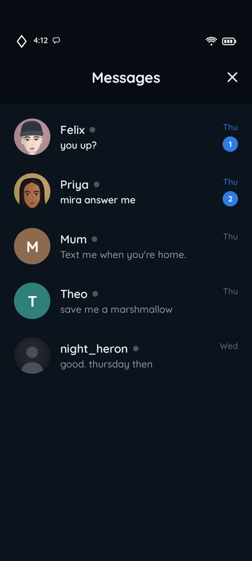 | 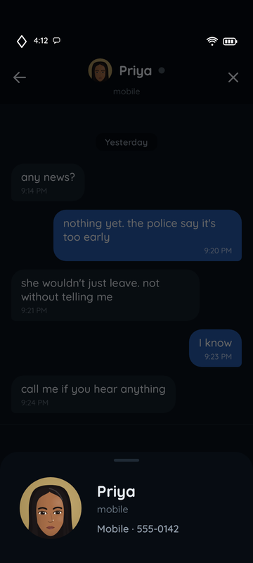 | 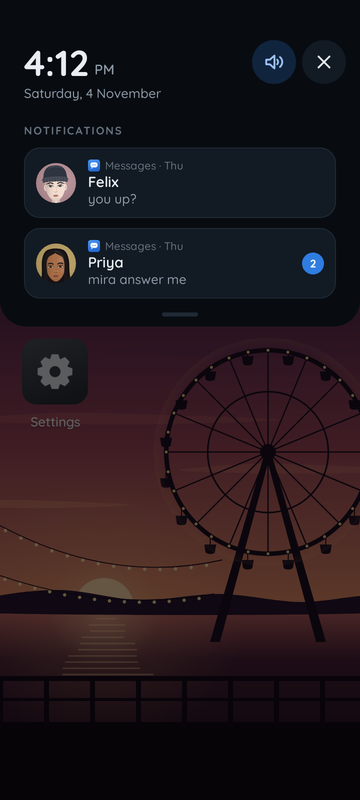 |

| Recent calls | Keypad | Number typed | Calling | Call ended |
|---|---|---|---|---|
| 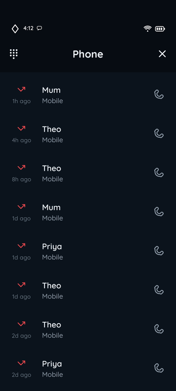 | 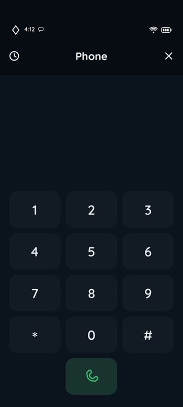 | 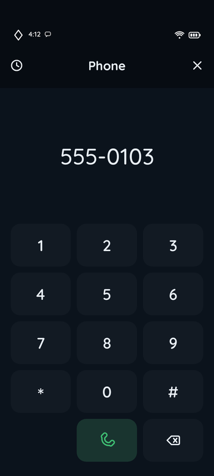 | 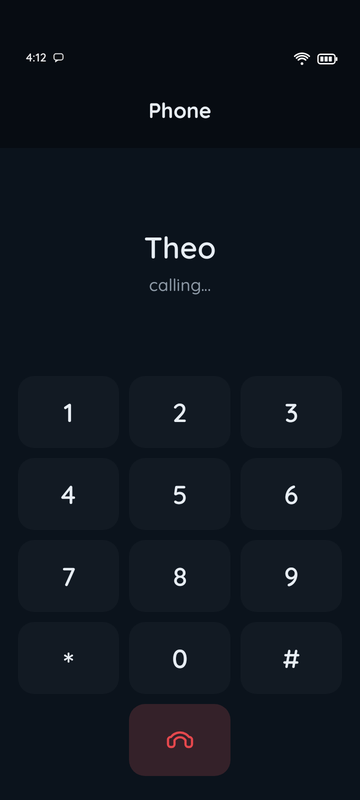 | 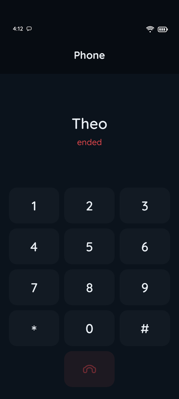 |

| Mail | Attachment | Picture | Gallery | Photo | Hidden photos |
|---|---|---|---|---|---|
| 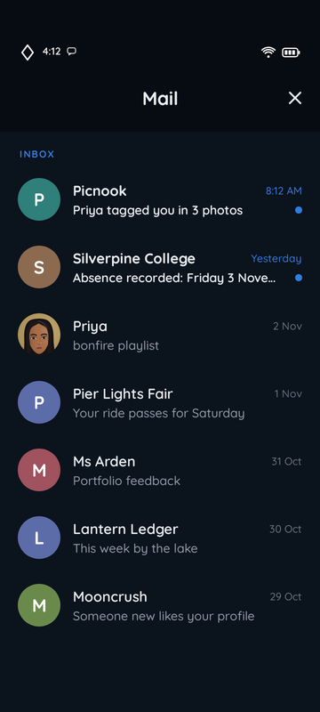 | 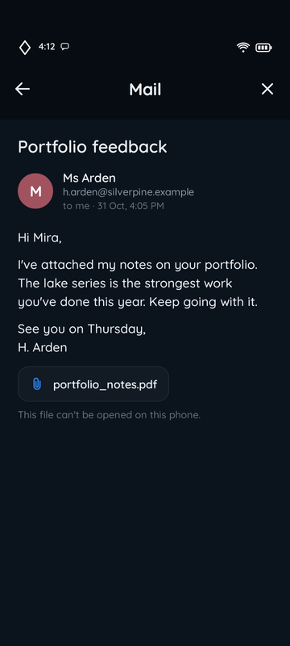 | 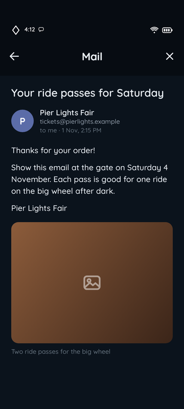 | 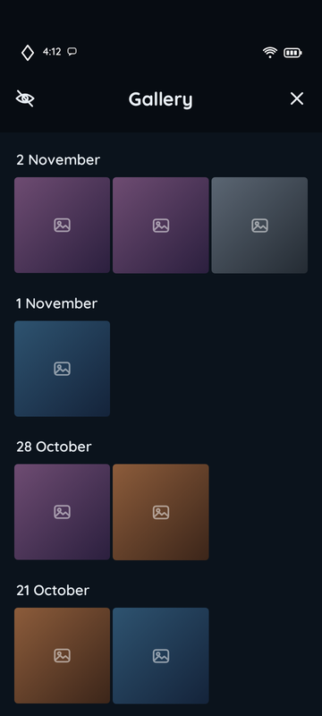 | 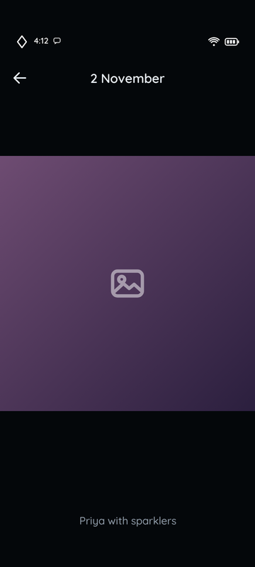 | 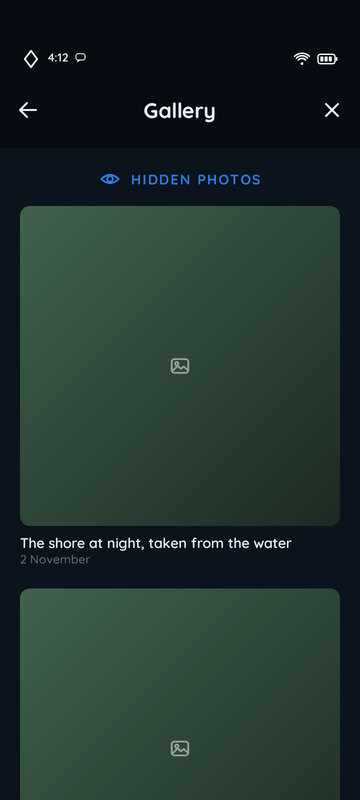 |

| Settings | How to play | Credits | Start over? |
|---|---|---|---|
| 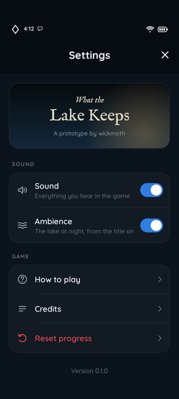 | 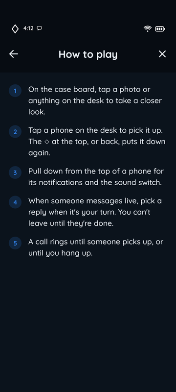 | 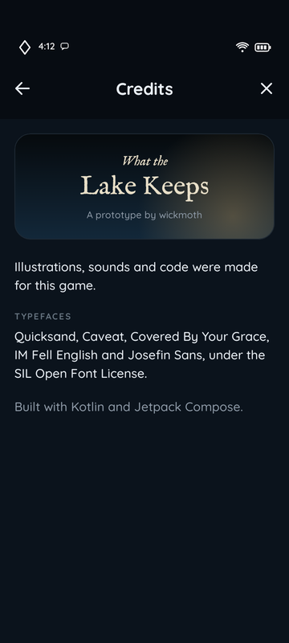 | 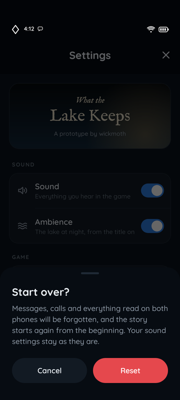 |

## Originality

The six reference screenshots this build was planned from belong to an existing commercial game.
This project keeps only their structure: the screen flow, the kinds of elements on each screen, and
how they behave. Everything you see or hear is original to this project: the studio name and
logo, game title, cast, story details, illustrations, icons, wallpapers, layout composition and
sounds. Treat **wickmoth** and **What the Lake Keeps** as placeholders. They live in
`res/values/strings.xml`.

The Messages app, status bar, notification shade, Phone, Mail, Gallery and Settings apps were
planned from further screenshots from the same game. Those served only as a functional reference
for layout, features and behaviour. Their visuals, names, numbers, addresses, emails and dialogue
are not reused, and the phone UI follows this game's own night palette and type. The reference
settings screen also had in-app purchases, a linked account, share and rate buttons and social
links. None of that is here.

## What's in the build

1. **Studio ident.** The wordmark writes itself in. The dot of its "i" catches as a candle flame,
   warms the nearby letters, and then gutters out in a curl of smoke.
2. **Headphones advisory.** The headphones settle in and hover while the line fades up beneath them.
3. **Title.** A moonlit lake fades up with a slow push-in. The lantern at the end of the pier
   catches and flickers, with its reflection on the water. Mist drifts, reeds sway, the empty boat
   bobs, stars twinkle, the subtitle tracks in, and a glint passes across the title.
4. **Case board.** Polaroids are pinned up outward from the missing girl, each with a pin sound.
   Threads run out from her pins, notes write themselves in, chalk lines and a marker symbol are
   drawn, and the stranger gets circled. Steam rises from the mug.
   - Tap a polaroid: it swings on its pin (a damped spring) while its threads and notes pulse.
     Tapping Mira sends a ripple through every thread.
   - Tap a desk prop: it lifts and settles.
   - Tap a phone: you pick it up.
5. **Phones (Theo's and Mira's).** The phone lifts off the desk and rotates upright to fill the
   screen, while the board recedes and dims. The screen wakes, the wallpaper settles, the status
   bar lights up, and the icons pop in with a stagger.
   - Icons respond with a press spring. Messages, Phone, Mail, Gallery and Settings open on both
     phones; the other apps give press feedback only.
   - The ◇ button, system back, or a predictive-back gesture puts the phone back down. During the
     gesture the phone shrinks with your swipe.
   - The status bar shows the in-game clock (it moves on as messages arrive), a message icon
     while notifications are waiting, and the owner's name on the home screen. The Messages and
     Mail icons carry unread counts. The Messages count pops in and bumps as messages land.
6. **Notification shade.** Pull the status bar down, or tap it. The shade shows a large clock and
   the date, a sound toggle that mutes every game sound and is remembered, and the waiting
   conversations. Tap a notification to open its conversation, or swipe it sideways to clear it.
   Back, the close button, or a tap below the panel closes it.
7. **Messages.** The app opens out of its icon (or out of the notification you tapped) and
   shrinks back into its icon when closed.
   - The inbox lists conversations newest first, with avatars, presence dots, previews, times and
     unread counts. Opening one slides it in over the inbox. Back or the arrow slides it away.
   - Conversations show day chips and grouped bubbles with times. Tap the contact's name for
     their contact card.
   - A live conversation: soon after Theo's phone first wakes, a private number messages him and a
     banner slides in (tap it, or flick it away). The contact types, you pick one of two replies,
     and the script branches on your choice. While they are online you cannot leave: the back
     and close buttons and the ◇ are hidden, and system back only nudges the replies. A moment
     after their last line they sign off, and navigation comes back.
   - Replies, what has been read, and cleared notifications are saved with the game.
8. **Phone.** Opens out of its icon like Messages. The header switches between recent calls and
   the keypad.
   - Recent calls, newest first: outgoing, incoming or missed, how long ago, the contact's name
     (or the number, if it isn't saved) and the kind of number. The handset at the end of a row
     calls back.
   - The keypad sounds each key's real dial tone as it goes down. The number groups itself as it
     is typed, and delete appears once there is a number (hold it to clear).
   - Calling shows who is being called, and "calling…" brightens with each ring. Nobody answers
     yet: after three rings, or when you hang up, the call shows "ended" and returns to where it
     was placed from, logged at the top of recent calls. While a call is on, the back, close and
     ◇ controls are hidden, system back only shakes the call, and notifications can't take you
     away.
   - Calls you make are saved with the game.
9. **Mail.** The inbox, newest first: sender, subject, and when it arrived (the time today,
   "Yesterday", or the date), with unread mail in bold and marked with a dot.
   - Opening an email slides it in over the inbox: the subject, the sender and their address, "to
     me" and the date, then the body.
   - Some emails carry a picture. Others carry an attachment, which shakes and says it can't be
     opened on this phone.
   - People this phone already talks to keep their Messages portrait. Everyone else gets their
     initial.
   - What has been read is saved with the game.
10. **Gallery.** Photos grouped by day, newest first, three to a row.
    - Tap a photo: it grows out of its thumbnail into a viewer with the date and its caption.
      Swipe sideways through the album. Back, the arrow, or a flick up or down sends it back
      into its thumbnail.
    - The crossed-out eye opens the hidden photos, laid out large with their captions. Mira has
      two. Theo has none, and his album says so.
11. **Settings.** The game's title card, then two groups.
    - **Sound:** a Sound switch (the same one as in the shade) and an Ambience switch for the lake
      loop. Both are remembered.
    - **Game:** How to play, Credits, and Reset progress. Reset asks first, in a sheet. Confirming
      forgets every message, call and email read on both phones, and the game starts again from
      the studio ident. Sound settings are kept.
    - The version number sits at the bottom.

Intro screens advance on their own, and a tap skips ahead. Taps carry haptics, and a synthesised
lake ambience plays from the title on, unless it is switched off in Settings. The ambience pauses
in the background and respects audio focus. There is no music. The phones add sound effects for
messages arriving and being sent, the notification chime, apps and the shade opening and closing,
a contact going offline, keypad tones, the ringing tone, the line dropping, switches, and the
hidden album opening. No sound plays while the game is in the background.

All conversations, contacts and call history are placeholders while the story is open.
Conversations live in `game/messages/Threads.kt`, written with a small script builder (`says`,
`ask`, `reply`). Each phone's address book and call history live in `game/phone/PhoneBook.kt`,
with numbers in the 555-01xx range kept for fiction; a test checks they match the numbers on the
Messages contact cards. Contacts from the board reuse their polaroid portraits. Everyone else gets
a lettered or no-photo placeholder.

Emails live in `game/mail/Inboxes.kt`, with addresses on `.example` domains. The photos in
`game/gallery/Albums.kt` are captions only for now: each one is drawn as a plain placeholder tile
(`screens/phone/Placeholder.kt`) in one of the game's night tones, and the same tile stands in for
pictures in emails. Swap in real images once the story's art is made. Dates count back from the
game's "today", Saturday 4 November, in `game/GameTime.kt`.

## Build and run

Requirements: JDK 17+ and an Android SDK with platform 37. The Gradle wrapper fetches everything else.

```sh
./gradlew :app:installDebug          # build and install on a connected device
./gradlew :app:assembleRelease       # R8-shrunk APK at app/build/outputs/apk/release/
```

The release build is signed with the local debug key so it can be sideloaded. Set up your own
upload key before publishing.

Toolchain: AGP 9.4, Kotlin 2.4, Compose BOM 2026.09, minSdk 26, targetSdk 36. The game runs
immersive full-screen and is laid out on a fixed 360 × 800 dp frame (the 9:20 reference). That
frame is scaled uniformly to fit, with full-bleed backgrounds around it on other aspect ratios.

## Tests

```sh
./gradlew :app:testDebugUnitTest      # message scripts and saved progress, plus flow tests on the real activity (Robolectric)
./gradlew :app:recordRoborazziDebug   # also renders every screen and animation frame to app/build/shots/
```

The flow tests include a whole live conversation, and a placed call, surviving the activity being
recreated, and a reset from Settings starting the story over.

## Art and audio pipelines

Illustrations are generated as vector drawables from Python sources in `tools/art`. Sounds are
synthesised from oscillators and filtered noise in `tools/audio`, so neither uses samples or
stock assets.

```sh
pip install fonttools numpy scipy
python3 tools/art/build.py [--preview]   # rewrites app/src/main/res/drawable/*.xml
python3 tools/audio/synth.py [name ...]  # rewrites app/src/main/res/raw/*.ogg, or only the named ones (needs ffmpeg)
```

`--preview` renders contact sheets to `tools/art/out/` using a local headless Chromium.

## Layout

```
app/src/main/kotlin/com/wickmoth/lakekeeps/
  MainActivity.kt          immersive window, splash hand-off, sound lifecycle
  game/                    stage flow and saved state
  game/messages/           conversation scripts, placeholder threads, message progress
  game/phone/              address books, call history, the calls the player makes
  game/mail/               placeholder inboxes, which emails have been read
  game/gallery/            placeholder albums
  ui/                      design frame, motion helpers, touch and haptics, fonts, palette
  audio/                   sound bank (SoundPool effects, looping ambience)
  screens/studio|advisory|title/
  screens/board/           board layout data, board rendering, desk, board-to-phone scene
  screens/phone/           home screens, status bar, shade and banner, the pick-up transition
  screens/phone/messages/  the Messages app: inbox, conversation, contact card
  screens/phone/calls/     the Phone app: recent calls, keypad, calling
  screens/phone/mail/      the Mail app: inbox, email
  screens/phone/gallery/   the Gallery app: albums, hidden photos, photo viewer
  screens/phone/settings/  the Settings app: sound, how to play, credits, reset
```

## Licences

Fonts are under the SIL Open Font License: Quicksand, Caveat, Covered By Your Grace, IM Fell
English and Josefin Sans. The licence texts ship in `app/src/main/assets/licenses/`.
